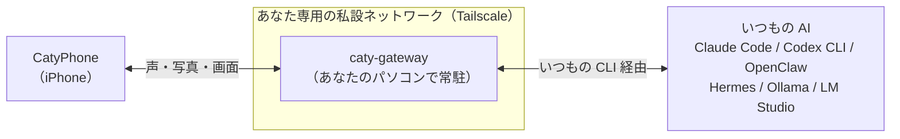

# caty-gateway

<div align="center">

[🇺🇸 English](README.md) ｜ **🇯🇵 日本語** ｜ [🇨🇳 简体中文](README.zh.md) ｜ [🇹🇭 ไทย](README.th.md)


<h4>あなたのパソコンで動いている AI と、iPhone アプリ CatyPhone から声で話せるようにする、小さな常駐プログラムです。</h4>

[](https://github.com/caty-ai/caty-gateway/actions/workflows/test-lint.yml)
[](LICENSE)


[できること](#what) ｜ [必要なもの](#requirements) ｜ [使いはじめる](#start) ｜ [安心の理由](#safety) ｜ [困ったとき](#troubleshooting) ｜ [もっと詳しく](#more)

パソコンの前を離れても、いつもの AI に iPhone から話しかけて、<br>
続きを頼んだり、写真や画面を見せたりできます。会話はあなたの機器の外に出ません。

**いつもの AI を、ポケットに連れて出る。**

🔧 [エンジニア向けドキュメント](docs/engineering.md) ｜ 📘 [詳細仕様](docs/reference.md)

</div>

---

## こんな経験はありませんか？

1 つでも心当たりがあれば、caty-gateway の出番です。

- パソコンで AI に作業を頼んで席を立ったら、続きの指示を出せなくなった
- 外出先で思いついたことを、帰ってからもう一度 AI に説明し直している
- スマホで撮った写真や画面を、パソコンの AI に見せたいのに送る手段がない
- スマホ用の AI アプリを別に契約したが、パソコンの AI とは記憶がつながらない

共通する原因はシンプルで、**パソコンの AI に、スマホから届く入口がない**ことです。
caty-gateway は、その入口だけを引き受けます。

なお caty-gateway は、**パソコンで AI エージェントかローカル LLM を動かしている人**のためのツールです。iPhone アプリ CatyPhone と組で使います。パソコン側に AI がない場合や、CatyPhone を使わない場合は対象外になります。

---

<a id="what"></a>

## できること

パソコンの AI と iPhone の CatyPhone を、あなた専用の私設ネットワークの中だけでつなぎます。



- 🎙️ **声で話す**

  iPhone に向かって話すと、パソコンの AI が答えを返します。前の会話の続きも覚えています。読み上げの声は任意で設定できます。

- 📷 **写真と画面を見せる**

  撮った写真や共有した画面を、そのまま AI に渡せます。「この画面のエラー、直して」が外出先から言えます。

- 🔗 **いつもの AI をそのまま使う**

  AI 側の設定や作業フォルダは変えません。Claude Code や Codex CLI など、ふだん使っている CLI を裏で呼ぶだけです。

- 🔒 **会話は機器の外に出ない**

  iPhone とパソコンの通信は Tailscale の私設ネットワークの中だけ。会話の記録もあなたのパソコンに置かれます。

パソコン側に必要なものは 3 つだけです。

---

<a id="requirements"></a>

## 使うのに必要なもの

パソコン側に「AI」「Tailscale」「ffmpeg」の 3 つ、iPhone 側に CatyPhone があれば動きます。

| 観点 | 対応 |
|---|---|
| パソコンの OS | ✅ macOS ／ ✅ Linux（Windows は WSL2 で ⚠️ 未検証） |
| iPhone | ✅ CatyPhone アプリ |
| Python | ✅ 3.10 以上（入れ方は下の折りたたみ） |
| ネットワーク | ✅ Tailscale（無料プランで可） |

**対応している AI（backend）**

「backend」は、caty-gateway が裏で話しかける AI のことです。`--backend` に書く値で選びます。

| ティア | AI | `--backend` の値 | 実会話の記録 |
|---|---|---|---|
| 同梱 | Claude Code | `claude` | 整備中 |
| 同梱 | Codex CLI | `codex` | 整備中 |
| 同梱 | OpenClaw | `openclaw` | 整備中 |
| 同梱 | Hermes | `hermes` | 整備中 |
| 同梱 | Ollama ／ LM Studio | `openai-compat` | 整備中 |
| 接続方式あり | vLLM ／ LiteLLM ／ OpenRouter | `openai-compat` | なし |
| 予定 | opencode ／ Aider ／ Goose ／ Kimi ／ Qwen ほか | — | なし |

- **同梱** — このリポジトリにアダプタとテストが入っている
- **接続方式あり** — OpenAI 互換 API として `openai-compat` でつながる
- **予定** — アダプタ未着手。追加の手順は [コントリビュート](#contributing) へ

「実会話の記録」は、実際に iPhone から会話を往復させた手順書がこのリポジトリに入っているかどうかです。記録が揃うまで、この列は「整備中」のままにします。

**パソコン側の前提 3 つ**

| 前提 | 確かめ方 | 無いときは |
|---|---|---|
| いつもの AI の CLI かサーバー | 例: `claude --version` | 各 AI の導入手順へ |
| Tailscale にログイン済み | `tailscale status` | [tailscale.com](https://tailscale.com/) で無料アカウントを作り、パソコンと iPhone の両方でログイン |
| ffmpeg | `ffmpeg -version` | macOS: `brew install ffmpeg` ／ Linux: `apt install ffmpeg` |

Tailscale は、あなたの機器同士だけをつなぐ私設ネットワークを作る無料のアプリです。caty-gateway は **iPhone とパソコンが同じ Tailscale ネットワークにいること**を前提にしていて、それ以外の経路からの接続は受け付けません。

揃ったら、コマンド 1 行から始めます。

---

<a id="start"></a>

## 使いはじめる

やることは 4 つです。入れる → 点検する → 設定する → QR を読む。

### AI に入れてもらう

ふだん使っている AI エージェントに、次の 3 行を貼って頼めます。

```text
https://github.com/caty-ai/caty-gateway を読んで、caty-gateway を入れてください。
入れ方は `uv tool install caty-gateway`（uv が無ければ `pipx install caty-gateway`。どちらも無ければ README の手順）。
入れたら `caty-gateway doctor --backend claude` を実行して、結果をそのまま見せてください。
```

コマンドを明記しているのは、入れ方をエージェントに発明させないためです。入るのは公式パッケージだけで、`doctor` は点検するだけで何も書き換えません。

### 自分で入れる

**1. 入れる**

```sh
uv tool install caty-gateway
```

`uv` が無ければ `pipx install caty-gateway` でも同じです。

**2. 点検する**

```sh
caty-gateway doctor --backend claude
```

`claude` の部分は、上の表の `--backend` の値に置き換えます。`PASS` と `WARN` だけになれば準備完了です。`FAIL` の行には直し方が一緒に出ます。`WARN` は「見るだけでは確認できなかった」項目で、その AI が普段どおり動いていれば先に進めます。

```text
PASS OS
PASS Python
PASS ffmpeg
PASS ffprobe
PASS tailscale executable
PASS tailscale login
PASS tailscale IPv4
PASS port
PASS public URL
PASS config directory
PASS state directory
PASS data directory
PASS claude version
PASS claude working directory
PASS claude credentials
```

**3. 設定する**

```sh
caty-gateway setup --member me --backend claude
```

`me` の部分は、あなたを表す英数字の短い名前に置き換えます（そのまま `me` でも構いません）。パソコンが起動するたびに動く常駐サービスが作られ、最後に QR コードが表示されます。先に中身だけ見たいときは `--plan-only` を付けると、何も書き換えずに実行予定が一覧で出ます。

**4. QR を読む**

CatyPhone を開き、表示された QR コードを読み取ります。iPhone とパソコンがつながり、話しかけられるようになります。QR は 10 分で期限が切れ、一度読むと使えなくなります。もう一度出すには、サービスと同じ環境変数で `caty-gateway qr` を実行します（手順は [QR の再発行](docs/engineering.md#reissue-qr)）。

<details>
<summary>つまずいたとき（command not found・uv や pipx が無い・Python が古い）</summary>

- **`caty-gateway: command not found`** — ターミナルを開き直してください。`uv tool install` が PATH の案内を出していたら、その 1 行を先に実行します。
- **`uv` も `pipx` も無い** — どちらか 1 つを入れます。uv: [docs.astral.sh/uv](https://docs.astral.sh/uv/getting-started/installation/) ／ pipx: [pipx.pypa.io](https://pipx.pypa.io/stable/installation/)。
- **Python が 3.10 より古い** — `uv tool install --python 3.12 caty-gateway` のように、uv に Python の用意も任せられます。
- **パッケージが見つからない（`No solution found` など）** — PyPI に公開される前の期間は、GitHub から直接入れられます: `uv tool install --from git+https://github.com/caty-ai/caty-gateway caty-gateway`
- **ターミナルとは** — macOS は「ターミナル.app」、Linux は端末アプリです。上のコマンドを 1 行ずつ貼って Enter を押します。

</details>

つながったところで、このツールが何をしないかを確認しておきます。

---

<a id="safety"></a>

## 安心して使える理由

caty-gateway は「入口」だけを担当し、AI にも会話にも余計なことをしません。

- **AI の設定を変えない**

  Claude Code などには、ふだんと同じ CLI を呼んで話しかけるだけです。作業フォルダも設定ファイルも書き換えません

- **点検は見るだけ**

  `doctor` はバージョンやログイン状態を確認するだけで、AI にプロンプトを送りません（利用枠を消費しません）

- **私設ネットワークの外から入れない**

  ペアリングの受付は、Tailscale のネットワーク内か、パソコン自身からの接続だけです

- **QR に長期の鍵は載らない**

  QR には 10 分で切れる 1 回きりの合言葉だけが入り、本当の鍵は読み取り後に別途渡されます

- **記録はあなたのパソコンに**

  会話の記録は `~/.local/state/caty-gateway/history/<名前>/` に置かれ、フォルダを消せば消えます

外部に送られるものは、音声の読み上げやアバター生成などの**任意機能を自分で有効にしたときだけ**です。どの機能が何を送るかは [プライバシー](docs/privacy.md) に書いてあります。

<details>
<summary>やめたいとき（丸ごと消す手順）</summary>

1. 常駐サービスを止めて外す（macOS は `~/Library/LaunchAgents/ai.caty.gateway.<名前>.plist`、Linux は `caty-gateway-<名前>.service`）。手順は [エンジニア向けドキュメント](docs/engineering.md#uninstall) にあります
2. 設定と記録のフォルダを消す: `~/.config/caty-gateway/`、`~/.local/state/caty-gateway/`、`~/.local/share/caty-gateway/`
3. 本体を消す: `uv tool uninstall caty-gateway`（pipx なら `pipx uninstall caty-gateway`）

AI 側には何も残りません。

</details>

それでも止まったときは、次の項目から探してください。

---

<a id="troubleshooting"></a>

## うまくいかないとき

まず `caty-gateway doctor --backend <値>` を実行し、`FAIL` の行の案内どおりに直します。それでも困ったら、下の症状から探してください。

<details>
<summary>`FAIL tailscale login` ／ `FAIL tailscale IPv4`</summary>

パソコンで Tailscale にログインしていません。Tailscale アプリを開いてログインし、`tailscale status` に自分のパソコンが出ることを確認してから、もう一度 `doctor` を実行します。

</details>

<details>
<summary>`FAIL port`（doctor）／ `port … is already listening`（setup）</summary>

同じポート番号を別のプログラムが使っています。`--port 8811` のように空いている番号を指定して `doctor` と `setup` を実行します。

</details>

<details>
<summary>`FAIL claude version` ／ `WARN claude credentials`（backend が見つからない・ログインを確認できない）</summary>

その AI の CLI が入っていないか、ログインしていません。`WARN claude credentials` は、ログイン情報が OS のキーチェーンにあって外から見えない場合にも出ます。ターミナルで `claude` が普段どおり動くなら、そのまま進めて構いません。ターミナルで一度その CLI を起動してログインしてから、`doctor` をやり直します。Ollama や LM Studio の場合は、サーバーを起動してから `CATY_OPENAI_BASE_URL` に `http://127.0.0.1:11434/v1` のような URL を設定します。

</details>

<details>
<summary>起動はしたのに、QR を読んでもつながらない</summary>

iPhone がパソコンと同じ Tailscale ネットワークにいないことがほとんどです。iPhone の Tailscale アプリで同じアカウントにログインし、接続がオンになっていることを確認して、[QR の再発行](docs/engineering.md#reissue-qr) の手順で新しい QR を出し直します。Tailscale 以外の経路（家の Wi-Fi の IP など）では、起動はできてもペアリングで止まります。

</details>

<details>
<summary>QR を読んだら「期限切れ」と出た</summary>

QR は表示から 10 分で切れます。[QR の再発行](docs/engineering.md#reissue-qr) の手順で出し直してください。

</details>

仕組みや設定の全体は、次のドキュメントにあります。

---

<a id="more"></a>

## もっと詳しく

読者ごとにページを分けています。リンク先は英語版です。エンジニア向けドキュメントと詳細仕様には日本語版があり、その 2 ページの先頭からたどれます。

| 知りたいこと | ページ |
|---|---|
| 仕組み・コマンド一覧・サービスの運用・アンインストール | [エンジニア向けドキュメント](docs/engineering.md) |
| 全コマンドの引数・保存先・ペアリングの決まりごと | [詳細仕様](docs/reference.md) |
| 環境変数の全表（自動生成） | [docs/env.md](docs/env.md) |
| どの機能が何を外部に送るか | [docs/privacy.md](docs/privacy.md) |
| ペアリングの通信仕様 | [docs/contracts/pairing-v1.md](docs/contracts/pairing-v1.md) |

backend の追加や修正は、次の手順で歓迎します。

---

<a id="contributing"></a>

## コントリビュート

自分の使っている AI を足すには、プリセットを 1 つ書き足すだけで始められます。

手順・テストの型・レビューの流れは [CONTRIBUTING.md](CONTRIBUTING.md) にあります。不具合や質問は [Issue](https://github.com/caty-ai/caty-gateway/issues) へどうぞ。

---

<a id="license"></a>

## ライセンス

[MIT License](LICENSE) です。自分の AI に自分で入口を付けられるように、誰でも自由に使って組み込めるライセンスを選びました。

---

<div align="center">

**コマンド 1 行** ｜ **いつもの AI をそのまま** ｜ **会話は機器の外に出ない**

</div>
