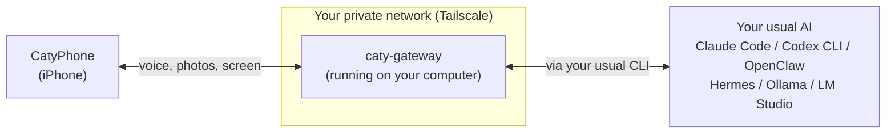

# caty-gateway

<div align="center">

**🇺🇸 English** ｜ [🇯🇵 日本語](README.ja.md) ｜ [🇨🇳 简体中文](README.zh.md) ｜ [🇹🇭 ไทย](README.th.md)


<h4>A small background program that lets you talk by voice, from the CatyPhone iPhone app, to the AI running on your computer.</h4>

[](https://github.com/caty-ai/caty-gateway/actions/workflows/test-lint.yml)
[](LICENSE)


[What it does](#what) ｜ [What you need](#requirements) ｜ [Getting started](#start) ｜ [Why it is safe](#safety) ｜ [When something goes wrong](#troubleshooting) ｜ [Learn more](#more)

Step away from your computer and you can still talk to your usual AI from your iPhone,<br/>
ask it to keep going, or show it a photo or your screen. Conversations never leave your own devices.

**Take your usual AI with you, in your pocket.**

🔧 [Engineering docs](docs/engineering.md) ｜ 📘 [Reference](docs/reference.md)

</div>

---

## Sound familiar?

If even one of these rings a bell, caty-gateway is for you.

- You asked your AI to do something on your computer, stepped away, and couldn't give it the next instruction
- You had an idea while out and about, and had to explain it to the AI all over again once you got home
- You wanted to show your computer's AI a photo or screenshot from your phone, but had no way to send it
- You signed up for a separate AI app on your phone, but it doesn't share memory with the AI on your computer

The common cause is simple: **your computer's AI has no way for your phone to reach it.**
caty-gateway takes care of exactly that, and nothing more.

Note that caty-gateway is a tool for **people already running an AI agent or a local LLM on their computer**. It's meant to be used together with the CatyPhone iPhone app. If you don't have an AI running on your computer, or don't use CatyPhone, this isn't for you.

---

<a id="what"></a>

## What it does

It connects the AI on your computer and CatyPhone on your iPhone, only inside a private network that belongs to you.



- 🎙️ **Talk by voice**

  Speak into your iPhone and the AI on your computer answers back. It remembers the earlier part of the conversation. You can optionally set a voice for its replies.

- 📷 **Show it photos and your screen**

  Send a photo you took, or your shared screen, straight to the AI. You can say "fix this error on my screen" while you're out.

- 🔗 **Uses your usual AI as-is**

  It doesn't change your AI's settings or working folder. It simply calls the CLI you already use, like Claude Code or Codex CLI, in the background.

- 🔒 **Conversations never leave your devices**

  Traffic between your iPhone and computer stays inside your private Tailscale network. Conversation history is also kept on your own computer.

On the computer side you only need three things.

---

<a id="requirements"></a>

## What you need

You need "an AI", "Tailscale", and "ffmpeg" on your computer, plus CatyPhone on your iPhone.

| Item | Support |
|---|---|
| Computer OS | ✅ macOS ／ ✅ Linux (Windows via WSL2 is ⚠️ untested) |
| iPhone | ✅ CatyPhone app |
| Python | ✅ 3.10 or later (see the collapsible section below for how to install it) |
| Network | ✅ Tailscale (the free plan works) |

**Supported AIs (backends)**

A "backend" is the AI that caty-gateway talks to behind the scenes. You choose it with the `--backend` value.

| Tier | AI | `--backend` value | Live-conversation record |
|---|---|---|---|
| Bundled | Claude Code | `claude` | In progress |
| Bundled | Codex CLI | `codex` | In progress |
| Bundled | OpenClaw | `openclaw` | In progress |
| Bundled | Hermes | `hermes` | In progress |
| Bundled | Ollama ／ LM Studio | `openai-compat` | In progress |
| Connectable | vLLM ／ LiteLLM ／ OpenRouter | `openai-compat` | None |
| Planned | opencode ／ Aider ／ Goose ／ Kimi ／ Qwen and others | — | None |

- **Bundled** — this repository ships an adapter and tests for it
- **Connectable** — connects through the `openai-compat` OpenAI-compatible API
- **Planned** — no adapter yet. See [Contributing](#contributing) for how to add one

"Live-conversation record" means whether this repository has a written walkthrough of an actual back-and-forth conversation from an iPhone. Until that record exists, this column stays "In progress".

**Three things your computer needs**

| Prerequisite | How to check | If it's missing |
|---|---|---|
| A CLI or server for your usual AI | e.g. `claude --version` | See that AI's own setup instructions |
| Logged in to Tailscale | `tailscale status` | Create a free account at [tailscale.com](https://tailscale.com/) and log in on both your computer and your iPhone |
| ffmpeg | `ffmpeg -version` | macOS: `brew install ffmpeg` ／ Linux: `apt install ffmpeg` |

Tailscale is a free app that creates a private network connecting only your own devices to each other. caty-gateway assumes **your iPhone and computer are on the same Tailscale network**, and does not accept connections from any other route.

Once you have these, you can get started with a single command.

---

<a id="start"></a>

## Getting started

There are four steps: install → check → set up → scan the QR code.

### Have your AI install it for you

You can paste the following three lines to your AI agent and ask it to do this for you.

```text
Please read https://github.com/caty-ai/caty-gateway and install caty-gateway.
To install it, run `uv tool install caty-gateway` (or `pipx install caty-gateway` if you don't have uv; if you have neither, follow the steps in the README).
Once installed, run `caty-gateway doctor --backend claude` and show me the result as-is.
```

The commands are spelled out on purpose, so the agent doesn't have to guess how to install it. Only the official package gets installed, and `doctor` only checks things — it never changes anything.

### Install it yourself

**1. Install**

```sh
uv tool install caty-gateway
```

If you don't have `uv`, `pipx install caty-gateway` works the same way.

**2. Check**

```sh
caty-gateway doctor --backend claude
```

Replace `claude` with the `--backend` value from the table above. When only `PASS` and `WARN` remain, you're ready to go. Any `FAIL` line comes with instructions for fixing it. `WARN` marks a check that could not be confirmed passively; if that AI works as usual, carry on.

```text
PASS OS
PASS Python
PASS ffmpeg
PASS ffprobe
PASS tailscale executable
PASS tailscale login
PASS tailscale IPv4
PASS port
PASS public URL
PASS config directory
PASS state directory
PASS data directory
PASS claude version
PASS claude working directory
PASS claude credentials
```

**3. Set up**

```sh
caty-gateway setup --member me --backend claude
```

Replace `me` with a short name for yourself using letters and numbers (or just keep `me`). This creates a background service that starts every time your computer boots, and shows a QR code at the end. If you just want to preview what it will do first, add `--plan-only` to see the full plan without changing anything.

**4. Scan the QR code**

Open CatyPhone and scan the QR code shown on screen. Your iPhone and computer will connect, and you'll be able to start talking. The QR code expires after 10 minutes, and can only be scanned once. To get a new one, run `caty-gateway qr` with the same environment variables as the service (see [Reissuing the QR](docs/engineering.md#reissue-qr)).

<details>
<summary>If something goes wrong (command not found, no uv or pipx, Python too old)</summary>

- **`caty-gateway: command not found`** — Reopen your terminal. If `uv tool install` printed a line about adding something to your PATH, run that line first.
- **Neither `uv` nor `pipx` is installed** — Install one of them. uv: [docs.astral.sh/uv](https://docs.astral.sh/uv/getting-started/installation/) ／ pipx: [pipx.pypa.io](https://pipx.pypa.io/stable/installation/).
- **Python is older than 3.10** — You can let uv install Python for you too, e.g. `uv tool install --python 3.12 caty-gateway`.
- **Package not found (`No solution found` or similar)** — Until the package is published on PyPI, install straight from GitHub: `uv tool install --from git+https://github.com/caty-ai/caty-gateway caty-gateway`
- **What's a terminal?** — On macOS it's "Terminal.app"; on Linux it's your terminal application. Paste the commands above one line at a time and press Enter.

</details>

Now that it's connected, here's what this tool deliberately does not do.

---

<a id="safety"></a>

## Why it is safe to install

caty-gateway only handles the "front door" — it doesn't do anything extra to your AI or your conversations.

- **It doesn't change your AI's settings**

  it talks to Claude Code and others by calling the same CLI you already use. It never touches your working folder or config files

- **Checks only look, they don't act**

  `doctor` only checks version numbers and login status; it never sends a prompt to your AI (so it never uses up any of your usage quota)

- **Nothing gets in from outside your private network**

  pairing requests are only accepted from inside your Tailscale network, or from the computer itself

- **The QR code never carries a long-lived key**

  it only contains a one-time password that expires in 10 minutes; the real key is handed over separately, after scanning

- **Records stay on your computer**

  conversation history is stored at `~/.local/state/caty-gateway/history/<name>/`, and deleting that folder deletes it

Nothing is ever sent externally, except for **optional features you turn on yourself**, such as text-to-speech or avatar generation. Which features send what is documented in [privacy](docs/privacy.md).

<details>
<summary>If you want to stop using it (full removal steps)</summary>

1. Stop and remove the background service (macOS: `~/Library/LaunchAgents/ai.caty.gateway.<name>.plist`; Linux: `caty-gateway-<name>.service`). Full steps are in the [Engineering docs](docs/engineering.md#uninstall)
2. Delete the config and history folders: `~/.config/caty-gateway/`, `~/.local/state/caty-gateway/`, `~/.local/share/caty-gateway/`
3. Remove the program itself: `uv tool uninstall caty-gateway` (or `pipx uninstall caty-gateway`)

Nothing is left behind on the AI's side.

</details>

If something still isn't working, look for it in the list below.

---

<a id="troubleshooting"></a>

## When something goes wrong

First run `caty-gateway doctor --backend <value>` and follow the instructions next to any `FAIL` line. If you're still stuck, look for your symptom below.

<details>
<summary>`FAIL tailscale login` ／ `FAIL tailscale IPv4`</summary>

You aren't logged in to Tailscale on your computer. Open the Tailscale app, log in, confirm your computer shows up in `tailscale status`, and run `doctor` again.

</details>

<details>
<summary>`FAIL port` (doctor) / `port … is already listening` (setup)</summary>

Another program is using the same port number. Run `doctor` and `setup` again with an open port, e.g. `--port 8811`.

</details>

<details>
<summary>`FAIL claude version` ／ `WARN claude credentials` (backend not found, or login cannot be confirmed)</summary>

That AI's CLI either isn't installed or you aren't logged in. `WARN claude credentials` also appears when your login lives in the OS keychain, which `doctor` cannot read. If `claude` works normally in your terminal, you can carry on. Start that CLI once in your terminal, log in, then run `doctor` again. For Ollama or LM Studio, start the server first, then set `CATY_OPENAI_BASE_URL` to a URL like `http://127.0.0.1:11434/v1`.

</details>

<details>
<summary>It started, but scanning the QR code doesn't connect</summary>

In most cases, your iPhone isn't on the same Tailscale network as your computer. Log in to the same Tailscale account on your iPhone's Tailscale app, confirm the connection is on, and generate a fresh QR code with `caty-gateway qr`. Any route other than Tailscale (like your home Wi-Fi's IP address) may start up fine but will get stuck at pairing.

</details>

<details>
<summary>Scanning the QR code says it "expired"</summary>

QR codes expire 10 minutes after they're shown. Follow [Reissuing the QR](docs/engineering.md#reissue-qr) to get a new one.

</details>

You can find the full picture of how it works and how to configure it in the documents below.

---

<a id="more"></a>

## Learn more

Documentation is split by what you're looking for. The Japanese versions are linked at the top of each page.

| What you want to know | Page |
|---|---|
| How it works, all commands, running the service, uninstalling | [Engineering docs](docs/engineering.md) |
| Every command's arguments, where files are saved, pairing rules | [Reference](docs/reference.md) |
| Full table of environment variables (auto-generated) | [docs/env.md](docs/env.md) |
| What each feature sends externally | [docs/privacy.md](docs/privacy.md) |
| Pairing protocol details | [docs/contracts/pairing-v1.md](docs/contracts/pairing-v1.md) |

Adding or fixing a backend is welcome — here's how.

---

<a id="contributing"></a>

## Contributing

Adding support for the AI you use can be as simple as writing one preset.

Setup steps, test conventions, and the review process are in [CONTRIBUTING.md](CONTRIBUTING.md). For bugs or questions, please open an [issue](https://github.com/caty-ai/caty-gateway/issues).

---

<a id="license"></a>

## License

[MIT License](LICENSE). We chose a license that lets anyone freely use and build with this, so you can add a front door to your own AI too.

---

<div align="center">

**One command** ｜ **Your usual AI, unchanged** ｜ **Conversations never leave your devices**

</div>
