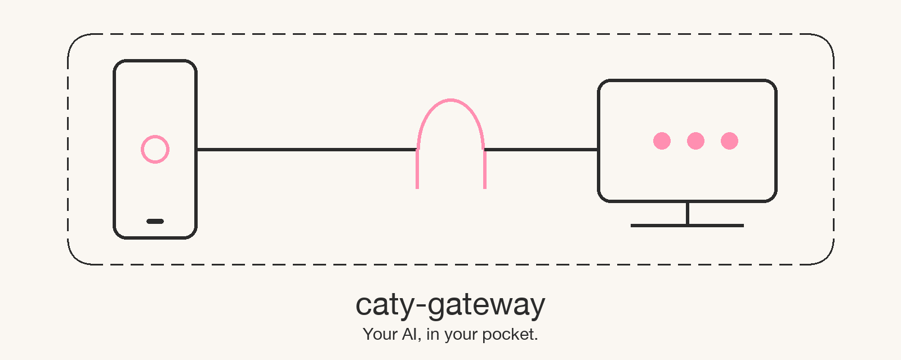
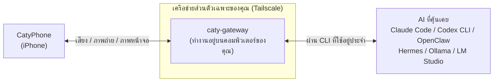

# caty-gateway

<div align="center">

[🇺🇸 English](README.md) ｜ [🇯🇵 日本語](README.ja.md) ｜ [🇨🇳 简体中文](README.zh.md) ｜ **🇹🇭 ไทย**



<h4>โปรแกรมขนาดเล็กที่ทำงานอยู่เบื้องหลัง ช่วยให้คุณพูดคุยด้วยเสียงกับ AI ที่ทำงานอยู่บนคอมพิวเตอร์ของคุณ ผ่านแอป iPhone ชื่อ CatyPhone</h4>

[](https://github.com/caty-ai/caty-gateway/actions/workflows/test-lint.yml)
[](LICENSE)


[ทำอะไรได้บ้าง](#what) ｜ [สิ่งที่ต้องมี](#requirements) ｜ [เริ่มใช้งาน](#start) ｜ [เหตุผลที่วางใจได้](#safety) ｜ [เมื่อมีปัญหา](#troubleshooting) ｜ [รายละเอียดเพิ่มเติม](#more)

แม้จะไม่ได้อยู่หน้าคอมพิวเตอร์ คุณก็พูดคุยกับ AI ตัวเดิมที่คุ้นเคยได้ผ่าน iPhone<br/>
สั่งให้ทำงานต่อ หรือส่งภาพถ่ายและภาพหน้าจอให้ดูได้ บทสนทนาจะไม่ออกไปนอกอุปกรณ์ของคุณ

**พา AI ที่คุ้นเคย ติดกระเป๋าออกไปด้วย**

🔧 [เอกสารสำหรับวิศวกร](docs/engineering.md) ｜ 📘 [ข้อกำหนดโดยละเอียด](docs/reference.md)

</div>

---

## เคยเจอเหตุการณ์แบบนี้ไหม

ถ้าตรงกับข้อใดข้อหนึ่ง caty-gateway จะมีประโยชน์กับคุณ

- สั่งงานให้ AI บนคอมพิวเตอร์ทำ แล้วลุกออกจากที่นั่ง กลับมาสั่งงานต่อไม่ได้
- นึกอะไรออกตอนอยู่นอกบ้าน แล้วต้องมาอธิบายให้ AI ฟังใหม่อีกครั้งหลังกลับถึงบ้าน
- อยากให้ AI บนคอมพิวเตอร์ดูภาพถ่ายหรือภาพหน้าจอที่ถ่ายด้วยสมาร์ตโฟน แต่ไม่มีวิธีส่ง
- สมัครแอป AI แยกต่างหากสำหรับสมาร์ตโฟน แต่ความจำไม่เชื่อมกับ AI บนคอมพิวเตอร์

สาเหตุร่วมนั้นเรียบง่ายมาก คือ **AI บนคอมพิวเตอร์ไม่มีทางเข้าจากสมาร์ตโฟน**
caty-gateway รับหน้าที่เป็นทางเข้านั้นเพียงอย่างเดียว

caty-gateway เป็นเครื่องมือสำหรับ **ผู้ที่รัน AI agent หรือ local LLM อยู่บนคอมพิวเตอร์** และใช้งานคู่กับแอป iPhone ชื่อ CatyPhone หากคอมพิวเตอร์ของคุณไม่มี AI หรือไม่ได้ใช้ CatyPhone เครื่องมือนี้จะไม่เหมาะกับคุณ

---

<a id="what"></a>

## ทำอะไรได้บ้าง

เชื่อมต่อ AI บนคอมพิวเตอร์กับ CatyPhone บน iPhone ภายในเครือข่ายส่วนตัวที่มีไว้สำหรับคุณคนเดียวเท่านั้น



- 🎙️ **พูดคุยด้วยเสียง**

  เมื่อคุณพูดใส่ iPhone AI บนคอมพิวเตอร์จะตอบกลับมา และยังจำบทสนทนาก่อนหน้าได้ต่อเนื่อง เสียงอ่านออกเสียงสามารถตั้งค่าเองได้ตามต้องการ

- 📷 **ส่งภาพถ่ายและภาพหน้าจอให้ดู**

  ส่งภาพถ่ายที่ถ่ายไว้หรือภาพหน้าจอที่แชร์ ให้ AI ดูได้โดยตรง แม้อยู่นอกบ้านก็พูดได้ว่า "ช่วยแก้ error ในหน้าจอนี้ให้หน่อย"

- 🔗 **ใช้ AI ตัวเดิมที่คุ้นเคยได้เหมือนเดิม**

  ไม่เปลี่ยนแปลงการตั้งค่าหรือโฟลเดอร์ทำงานของฝั่ง AI เพียงแค่เรียกใช้ CLI ที่คุณใช้อยู่ประจำ เช่น Claude Code หรือ Codex CLI อยู่เบื้องหลังเท่านั้น

- 🔒 **บทสนทนาไม่ออกไปนอกอุปกรณ์**

  การสื่อสารระหว่าง iPhone กับคอมพิวเตอร์อยู่ภายในเครือข่ายส่วนตัวของ Tailscale เท่านั้น และประวัติการสนทนาก็ถูกเก็บไว้บนคอมพิวเตอร์ของคุณเช่นกัน

ฝั่งคอมพิวเตอร์ต้องเตรียมเพียง 3 อย่างเท่านั้น

---

<a id="requirements"></a>

## สิ่งที่ต้องมี

ขอเพียงคอมพิวเตอร์มี "AI" "Tailscale" "ffmpeg" ทั้ง 3 อย่าง และฝั่ง iPhone มี CatyPhone ก็ใช้งานได้แล้ว

| หัวข้อ | รองรับ |
|---|---|
| ระบบปฏิบัติการของคอมพิวเตอร์ | ✅ macOS ／ ✅ Linux (Windows ใช้ผ่าน WSL2 ⚠️ ยังไม่ได้ทดสอบ) |
| iPhone | ✅ แอป CatyPhone |
| Python | ✅ 3.10 ขึ้นไป (วิธีติดตั้งดูในส่วนพับด้านล่าง) |
| เครือข่าย | ✅ Tailscale (ใช้แผนฟรีได้) |

**AI (backend) ที่รองรับ**

"backend" คือ AI ที่ caty-gateway เรียกใช้อยู่เบื้องหลัง เลือกได้ด้วยค่าที่ใส่ใน `--backend`

| ระดับ | AI | ค่าของ `--backend` | บันทึกการสนทนาจริง |
|---|---|---|---|
| มาพร้อมในตัว | Claude Code | `claude` | อยู่ระหว่างจัดเตรียม |
| มาพร้อมในตัว | Codex CLI | `codex` | อยู่ระหว่างจัดเตรียม |
| มาพร้อมในตัว | OpenClaw | `openclaw` | อยู่ระหว่างจัดเตรียม |
| มาพร้อมในตัว | Hermes | `hermes` | อยู่ระหว่างจัดเตรียม |
| มาพร้อมในตัว | Ollama ／ LM Studio | `openai-compat` | อยู่ระหว่างจัดเตรียม |
| มีวิธีเชื่อมต่อ | vLLM ／ LiteLLM ／ OpenRouter | `openai-compat` | ไม่มี |
| อยู่ในแผน | opencode ／ Aider ／ Goose ／ Kimi ／ Qwen เป็นต้น | — | ไม่มี |

- **มาพร้อมในตัว** — มีอะแดปเตอร์และชุดทดสอบอยู่ในรีโพซิทอรีนี้แล้ว
- **มีวิธีเชื่อมต่อ** — เชื่อมต่อผ่าน `openai-compat` ในฐานะ API ที่รองรับรูปแบบของ OpenAI
- **อยู่ในแผน** — ยังไม่เริ่มพัฒนาอะแดปเตอร์ ดูขั้นตอนเพิ่มเติมได้ที่ [การร่วมพัฒนา](#contributing)

"บันทึกการสนทนาจริง" หมายถึงว่ามีคู่มือขั้นตอนที่ทดลองสนทนาไปกลับจาก iPhone จริงอยู่ในรีโพซิทอรีนี้หรือไม่ คอลัมน์นี้จะแสดง "อยู่ระหว่างจัดเตรียม" จนกว่าจะมีบันทึกครบถ้วน

**สิ่งที่ต้องมีในคอมพิวเตอร์ 3 อย่าง**

| สิ่งที่ต้องมี | วิธีตรวจสอบ | ถ้ายังไม่มี |
|---|---|---|
| CLI หรือเซิร์ฟเวอร์ของ AI ที่คุ้นเคย | เช่น `claude --version` | ไปที่ขั้นตอนติดตั้งของ AI แต่ละตัว |
| ล็อกอิน Tailscale แล้ว | `tailscale status` | สร้างบัญชีฟรีที่ [tailscale.com](https://tailscale.com/) แล้วล็อกอินทั้งบนคอมพิวเตอร์และ iPhone |
| ffmpeg | `ffmpeg -version` | macOS: `brew install ffmpeg` ／ Linux: `apt install ffmpeg` |

Tailscale คือแอปฟรีที่สร้างเครือข่ายส่วนตัวเชื่อมต่อเฉพาะระหว่างอุปกรณ์ของคุณเอง caty-gateway ตั้งเงื่อนไขว่า **iPhone และคอมพิวเตอร์ต้องอยู่ในเครือข่าย Tailscale เดียวกัน** และจะไม่รับการเชื่อมต่อจากเส้นทางอื่นใดนอกเหนือจากนี้

เมื่อพร้อมครบแล้ว เริ่มต้นได้ด้วยคำสั่งเพียงบรรทัดเดียว

---

<a id="start"></a>

## เริ่มใช้งาน

สิ่งที่ต้องทำมี 4 ขั้นตอน คือ ติดตั้ง → ตรวจสอบ → ตั้งค่า → สแกน QR

### ให้ AI ช่วยติดตั้งให้

คุณสามารถวางข้อความ 3 บรรทัดต่อไปนี้ให้ AI agent ที่ใช้อยู่ประจำ แล้วขอให้ทำให้ได้เลย

```text
ช่วยอ่าน https://github.com/caty-ai/caty-gateway แล้วช่วยติดตั้ง caty-gateway ให้หน่อย
วิธีติดตั้งคือ `uv tool install caty-gateway` (ถ้าไม่มี uv ให้ใช้ `pipx install caty-gateway` ถ้าไม่มีทั้งสองอย่าง ให้ดูขั้นตอนใน README)
เมื่อติดตั้งเสร็จแล้ว ให้รัน `caty-gateway doctor --backend claude` แล้วแสดงผลลัพธ์ให้ดูตามที่ได้เลย
```

เหตุผลที่ระบุคำสั่งไว้ชัดเจนคือ เพื่อไม่ให้ AI agent คิดวิธีติดตั้งขึ้นมาเอง สิ่งที่จะถูกติดตั้งมีเพียงแพ็กเกจทางการเท่านั้น และ `doctor` เป็นเพียงการตรวจสอบ ไม่มีการเขียนทับข้อมูลใด ๆ

### ติดตั้งด้วยตัวเอง

**1. ติดตั้ง**

```sh
uv tool install caty-gateway
```

ถ้าไม่มี `uv` ก็ใช้ `pipx install caty-gateway` ได้ผลลัพธ์เหมือนกัน

**2. ตรวจสอบ**

```sh
caty-gateway doctor --backend claude
```

ส่วน `claude` ให้เปลี่ยนเป็นค่าของ `--backend` ตามตารางด้านบน ถ้าเหลือแต่ `PASS` กับ `WARN` แปลว่าพร้อมใช้งานแล้ว ถ้ามีบรรทัด `FAIL` จะมีวิธีแก้ไขแสดงมาด้วย `WARN` คือรายการที่ยืนยันไม่ได้จากการดูเพียงอย่างเดียว ถ้า AI ตัวนั้นใช้งานได้ตามปกติก็ดำเนินการต่อได้

```text
PASS OS
PASS Python
PASS ffmpeg
PASS ffprobe
PASS tailscale executable
PASS tailscale login
PASS tailscale IPv4
PASS port
PASS public URL
PASS config directory
PASS state directory
PASS data directory
PASS claude version
PASS claude working directory
PASS claude credentials
```

**3. ตั้งค่า**

```sh
caty-gateway setup --member me --backend claude
```

เปลี่ยน `me` เป็นชื่อสั้น ๆ ของคุณที่ใช้ตัวอักษรและตัวเลข (หรือจะใช้ `me` ตามเดิมก็ได้) ระบบจะสร้างบริการเบื้องหลังที่ทำงานทุกครั้งเมื่อคอมพิวเตอร์เปิดเครื่อง และแสดงรหัส QR ขึ้นในตอนท้าย หากต้องการดูรายละเอียดก่อนโดยยังไม่เขียนทับสิ่งใด ให้ใส่ `--plan-only` เพื่อดูรายการสิ่งที่จะทำทั้งหมด

**4. สแกน QR**

เปิด CatyPhone แล้วสแกนรหัส QR ที่แสดงขึ้นมา iPhone กับคอมพิวเตอร์จะเชื่อมต่อกัน และคุณจะพูดคุยกันได้ QR จะหมดอายุใน 10 นาที และเมื่อสแกนใช้แล้วครั้งหนึ่งจะใช้ซ้ำไม่ได้ หากต้องการแสดง QR ใหม่อีกครั้ง ให้รัน `caty-gateway qr` ด้วยตัวแปรสภาพแวดล้อมชุดเดียวกับบริการ (ดูขั้นตอนที่ [การออก QR ใหม่](docs/engineering.md#reissue-qr))

<details>
<summary>เมื่อติดขัด (command not found / ไม่มี uv หรือ pipx / Python เก่าเกินไป)</summary>

- **`caty-gateway: command not found`** — ให้เปิดเทอร์มินัลใหม่อีกครั้ง ถ้า `uv tool install` แสดงคำแนะนำเกี่ยวกับ PATH ไว้ ให้รันบรรทัดนั้นก่อน
- **ไม่มีทั้ง `uv` และ `pipx`** — ให้ติดตั้งอย่างใดอย่างหนึ่ง uv: [docs.astral.sh/uv](https://docs.astral.sh/uv/getting-started/installation/) ／ pipx: [pipx.pypa.io](https://pipx.pypa.io/stable/installation/)
- **Python เก่ากว่า 3.10** — ใช้คำสั่งแบบ `uv tool install --python 3.12 caty-gateway` เพื่อให้ uv จัดการติดตั้ง Python ให้ด้วยได้
- **หาแพ็กเกจไม่พบ (`No solution found` เป็นต้น)** — ก่อนที่แพ็กเกจจะเผยแพร่บน PyPI สามารถติดตั้งจาก GitHub ได้โดยตรง: `uv tool install --from git+https://github.com/caty-ai/caty-gateway caty-gateway`
- **เทอร์มินัลคืออะไร** — บน macOS คือ "Terminal.app" บน Linux คือแอปเทอร์มินัล ให้วางคำสั่งด้านบนทีละบรรทัดแล้วกด Enter

</details>

เมื่อเชื่อมต่อสำเร็จแล้ว มาดูกันว่าเครื่องมือนี้ "ไม่ทำ" อะไรบ้าง

---

<a id="safety"></a>

## เหตุผลที่วางใจได้

caty-gateway ทำหน้าที่เป็นเพียง "ทางเข้า" เท่านั้น ไม่ทำสิ่งใดเกินความจำเป็นต่อทั้ง AI และบทสนทนา

- **ไม่เปลี่ยนการตั้งค่าของ AI**

  สำหรับ Claude Code และอื่น ๆ เพียงแค่เรียกใช้ CLI แบบเดิมที่คุณใช้อยู่ประจำเท่านั้น ไม่แตะต้องโฟลเดอร์ทำงานหรือไฟล์ตั้งค่าใด ๆ

- **การตรวจสอบเป็นเพียงการดูเท่านั้น**

  `doctor` เพียงตรวจสอบเวอร์ชันและสถานะการล็อกอิน ไม่ได้ส่งพรอมป์ไปยัง AI (ไม่ใช้โควตาการใช้งาน)

- **ไม่รับการเชื่อมต่อจากนอกเครือข่ายส่วนตัว**

  การจับคู่ (pairing) จะรับเฉพาะจากภายในเครือข่าย Tailscale หรือจากคอมพิวเตอร์เครื่องนั้นเองเท่านั้น

- **QR ไม่มีคีย์ระยะยาวฝังอยู่**

  ใน QR มีเพียงรหัสผ่านใช้ครั้งเดียวที่หมดอายุใน 10 นาทีเท่านั้น ส่วนคีย์จริงจะถูกส่งแยกต่างหากหลังจากสแกนแล้ว

- **บันทึกอยู่ในคอมพิวเตอร์ของคุณ**

  ประวัติการสนทนาถูกเก็บไว้ที่ `~/.local/state/caty-gateway/history/<ชื่อ>/` ลบโฟลเดอร์นี้ก็ลบข้อมูลได้

สิ่งที่ถูกส่งออกไปภายนอกมีเฉพาะกรณีที่คุณ **เปิดใช้งานฟีเจอร์เสริมด้วยตัวเอง** เช่น การอ่านออกเสียงหรือการสร้างอวาตาร์เท่านั้น รายละเอียดว่าฟีเจอร์ใดส่งอะไรออกไป ดูได้ที่ [ความเป็นส่วนตัว](docs/privacy.md)

<details>
<summary>เมื่อต้องการเลิกใช้งาน (ขั้นตอนลบทั้งหมด)</summary>

1. หยุดและถอนบริการเบื้องหลัง (macOS คือ `~/Library/LaunchAgents/ai.caty.gateway.<ชื่อ>.plist`, Linux คือ `caty-gateway-<ชื่อ>.service`) ขั้นตอนละเอียดดูที่ [เอกสารสำหรับวิศวกร](docs/engineering.md#uninstall)
2. ลบโฟลเดอร์การตั้งค่าและบันทึก: `~/.config/caty-gateway/`、`~/.local/state/caty-gateway/`、`~/.local/share/caty-gateway/`
3. ลบตัวโปรแกรม: `uv tool uninstall caty-gateway` (ถ้าใช้ pipx ก็ `pipx uninstall caty-gateway`)

ฝั่ง AI จะไม่มีอะไรหลงเหลืออยู่เลย

</details>

หากยังติดขัดอยู่ ให้ค้นหาจากหัวข้อด้านล่างนี้

---

<a id="troubleshooting"></a>

## เมื่อใช้งานไม่ได้ผล

ก่อนอื่นให้รัน `caty-gateway doctor --backend <ค่า>` แล้วแก้ไขตามคำแนะนำในบรรทัดที่ขึ้น `FAIL` หากยังแก้ไม่ได้ ให้ค้นหาจากอาการด้านล่างนี้

<details>
<summary>`FAIL tailscale login` ／ `FAIL tailscale IPv4`</summary>

แสดงว่าคอมพิวเตอร์ยังไม่ได้ล็อกอิน Tailscale ให้เปิดแอป Tailscale แล้วล็อกอิน จากนั้นตรวจสอบว่าคอมพิวเตอร์ของคุณปรากฏใน `tailscale status` แล้วจึงรัน `doctor` อีกครั้ง

</details>

<details>
<summary>`FAIL port` (doctor) / `port … is already listening` (setup)</summary>

มีโปรแกรมอื่นใช้พอร์ตหมายเลขเดียวกันอยู่ ให้ระบุหมายเลขพอร์ตที่ว่างแบบ `--port 8811` แล้วรัน `doctor` และ `setup` อีกครั้ง

</details>

<details>
<summary>`FAIL claude version` ／ `WARN claude credentials` (ไม่พบ backend หรือยืนยันการล็อกอินไม่ได้)</summary>

แสดงว่ายังไม่ได้ติดตั้ง CLI ของ AI ตัวนั้น หรือยังไม่ได้ล็อกอิน `WARN claude credentials` จะแสดงด้วยเมื่อข้อมูลล็อกอินอยู่ในคีย์เชนของระบบซึ่ง `doctor` อ่านไม่ได้ ถ้า `claude` ใช้งานได้ตามปกติในเทอร์มินัล ก็ดำเนินการต่อได้เลย ให้เปิด CLI ตัวนั้นในเทอร์มินัลแล้วล็อกอินก่อนหนึ่งครั้ง จากนั้นรัน `doctor` ใหม่อีกครั้ง สำหรับกรณี Ollama หรือ LM Studio ให้เปิดเซิร์ฟเวอร์ก่อน แล้วตั้งค่า `CATY_OPENAI_BASE_URL` เป็น URL เช่น `http://127.0.0.1:11434/v1`

</details>

<details>
<summary>เริ่มระบบสำเร็จแล้ว แต่สแกน QR แล้วเชื่อมต่อไม่ได้</summary>

ส่วนใหญ่เกิดจาก iPhone ไม่ได้อยู่ในเครือข่าย Tailscale เดียวกันกับคอมพิวเตอร์ ให้ล็อกอินแอป Tailscale บน iPhone ด้วยบัญชีเดียวกัน ตรวจสอบว่าการเชื่อมต่อเปิดอยู่ แล้วออก QR ใหม่ตามขั้นตอนที่ [การออก QR ใหม่](docs/engineering.md#reissue-qr) เส้นทางอื่นที่ไม่ใช่ Tailscale (เช่น IP ของ Wi-Fi ที่บ้าน) อาจเริ่มระบบได้ แต่จะติดขัดที่ขั้นตอนจับคู่ (pairing)

</details>

<details>
<summary>สแกน QR แล้วขึ้นว่า "หมดอายุ"</summary>

QR จะหมดอายุภายใน 10 นาทีหลังแสดงผล กรุณาออกรหัสใหม่ตามขั้นตอนที่ [การออก QR ใหม่](docs/engineering.md#reissue-qr)

</details>

โครงสร้างและการตั้งค่าโดยรวมของระบบทั้งหมด ดูได้ในเอกสารต่อไปนี้

---

<a id="more"></a>

## รายละเอียดเพิ่มเติม

แยกหน้าเอกสารตามกลุ่มผู้อ่าน ลิงก์เป็นฉบับภาษาอังกฤษ และด้านบนของแต่ละหน้ามีลิงก์ไปยังฉบับภาษาญี่ปุ่น

| สิ่งที่อยากรู้ | หน้าเอกสาร |
|---|---|
| กลไกการทำงาน รายการคำสั่งทั้งหมด การดูแลบริการ การถอนการติดตั้ง | [เอกสารสำหรับวิศวกร](docs/engineering.md) |
| อาร์กิวเมนต์ของทุกคำสั่ง / ตำแหน่งจัดเก็บ / กติกาการจับคู่ (pairing) | [ข้อกำหนดโดยละเอียด](docs/reference.md) |
| ตารางตัวแปรสภาพแวดล้อมทั้งหมด (สร้างอัตโนมัติ) | [docs/env.md](docs/env.md) |
| ฟีเจอร์ใดส่งข้อมูลอะไรออกไปภายนอก | [docs/privacy.md](docs/privacy.md) |
| ข้อกำหนดการสื่อสารของการจับคู่ (pairing) | [docs/contracts/pairing-v1.md](docs/contracts/pairing-v1.md) |

การเพิ่มหรือแก้ไข backend สามารถทำได้ตามขั้นตอนต่อไปนี้ ยินดีต้อนรับ

---

<a id="contributing"></a>

## การร่วมพัฒนา

หากต้องการเพิ่ม AI ที่คุณใช้อยู่ ให้เริ่มต้นได้เพียงเขียน preset เพิ่มขึ้นมา 1 ตัว

ขั้นตอน / รูปแบบการทดสอบ / กระบวนการรีวิว ดูได้ที่ [CONTRIBUTING.md](CONTRIBUTING.md) หากพบปัญหาหรือมีคำถาม แจ้งได้ที่ [Issue](https://github.com/caty-ai/caty-gateway/issues)

---

<a id="license"></a>

## สัญญาอนุญาต

เป็น [MIT License](LICENSE) เราเลือกสัญญาอนุญาตนี้เพื่อให้ทุกคนสามารถใช้และนำไปประกอบเข้ากับ AI ของตนเองได้อย่างอิสระ เพื่อสร้างทางเข้าให้ AI ของตัวเองได้ด้วยตัวเอง

---

<div align="center">

**คำสั่งเพียงบรรทัดเดียว** ｜ **ใช้ AI ที่คุ้นเคยได้เหมือนเดิม** ｜ **บทสนทนาไม่ออกไปนอกอุปกรณ์**

</div>
