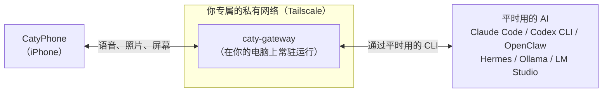

# caty-gateway

<div align="center">

[🇺🇸 English](README.md) ｜ [🇯🇵 日本語](README.ja.md) ｜ **🇨🇳 简体中文** ｜ [🇹🇭 ไทย](README.th.md)


<h4>一个小巧的常驻程序，让你可以从 iPhone 应用 CatyPhone 用语音，和你电脑上正在运行的 AI 对话。</h4>

[](https://github.com/caty-ai/caty-gateway/actions/workflows/test-lint.yml)
[](LICENSE)


[能做什么](#what) ｜ [需要准备什么](#requirements) ｜ [开始使用](#start) ｜ [为什么放心](#safety) ｜ [遇到问题](#troubleshooting) ｜ [了解更多](#more)

即使离开电脑，也能用 iPhone 对着平时用的 AI 说话，<br>
让它继续手头的工作，或者把照片、屏幕内容拿给它看。对话内容不会离开你的设备。

**把平时用的 AI，装进口袋随身带走。**

🔧 [面向工程师的文档](docs/engineering.md) ｜ 📘 [详细规格](docs/reference.md)

</div>

---

## 你是否遇到过这样的情况？

只要有一条符合，caty-gateway 就是为你准备的。

- 让电脑上的 AI 干活后离开座位，就没法再下达后续指示了
- 在外面想到的事情，回家后还要再向 AI 解释一遍
- 想把手机拍的照片或截图给电脑上的 AI 看，却没有传送的办法
- 另外订阅了手机端的 AI 应用，但它和电脑上的 AI 记忆并不相通

原因很简单：**电脑上的 AI，没有一个能从手机进入的入口**。
caty-gateway 只负责补上这个入口。

需要说明的是，caty-gateway 是为**在电脑上运行 AI 代理或本地 LLM 的人**准备的工具，需要搭配 iPhone 应用 CatyPhone 一起使用。如果电脑上没有 AI，或者不使用 CatyPhone，就不适用本工具。

---

<a id="what"></a>

## 能做什么

caty-gateway 只在你专属的私有网络内部，把电脑上的 AI 和 iPhone 上的 CatyPhone 连接起来。



- 🎙️ **用语音对话**

  对着 iPhone 说话，电脑上的 AI 就会回答。之前对话的内容也会被记住。朗读用的声音可以自由设置。

- 📷 **把照片和屏幕内容给它看**

  拍下的照片或共享的屏幕，可以直接交给 AI。就算人在外面，也能说出「这个画面报错了，帮我修一下」。

- 🔗 **原样使用平时的 AI**

  不会改动 AI 那一侧的设置或工作目录，只是在后台调用你平常使用的 CLI，比如 Claude Code 或 Codex CLI。

- 🔒 **对话不会离开设备**

  iPhone 与电脑之间的通信，只经过 Tailscale 的私有网络。对话记录也保存在你自己的电脑上。

电脑这一侧只需要准备 3 样东西。

---

<a id="requirements"></a>

## 需要准备什么

只要电脑一侧具备「AI」「Tailscale」「ffmpeg」这 3 项，iPhone 一侧安装 CatyPhone，就能运行。

| 项目 | 支持情况 |
|---|---|
| 电脑操作系统 | ✅ macOS ／ ✅ Linux（Windows 可通过 WSL2 使用，但 ⚠️ 尚未验证） |
| iPhone | ✅ CatyPhone 应用 |
| Python | ✅ 3.10 以上（安装方法见下方折叠内容） |
| 网络 | ✅ Tailscale（免费方案即可） |

**支持的 AI（backend）**

「backend」指的是 caty-gateway 在后台对话的 AI。通过 `--backend` 填写的值来选择。

| 等级 | AI | `--backend` 的值 | 实际对话记录 |
|---|---|---|---|
| 内置 | Claude Code | `claude` | 整理中 |
| 内置 | Codex CLI | `codex` | 整理中 |
| 内置 | OpenClaw | `openclaw` | 整理中 |
| 内置 | Hermes | `hermes` | 整理中 |
| 内置 | Ollama ／ LM Studio | `openai-compat` | 整理中 |
| 有对接方式 | vLLM ／ LiteLLM ／ OpenRouter | `openai-compat` | 无 |
| 计划中 | opencode ／ Aider ／ Goose ／ Kimi ／ Qwen 等 | — | 无 |

- **内置** — 本仓库中已包含相应的适配器和测试
- **有对接方式** — 可通过兼容 OpenAI 的 `openai-compat` 方式接入
- **计划中** — 适配器尚未着手开发。追加步骤见[参与贡献](#contributing)

「实际对话记录」是指本仓库中是否收录了真正从 iPhone 往返进行对话的操作说明。在记录齐全之前，这一列会一直标注为「整理中」。

**电脑一侧的 3 项前提条件**

| 前提条件 | 确认方法 | 没有时怎么办 |
|---|---|---|
| 平时用的 AI 的 CLI 或服务器 | 例如：`claude --version` | 参考各 AI 的安装说明 |
| 已登录 Tailscale | `tailscale status` | 前往 [tailscale.com](https://tailscale.com/) 注册免费账号，在电脑和 iPhone 两端都登录 |
| ffmpeg | `ffmpeg -version` | macOS: `brew install ffmpeg` ／ Linux: `apt install ffmpeg` |

Tailscale 是一款免费应用，用来搭建只连接你自己设备之间的私有网络。caty-gateway 的前提是 **iPhone 和电脑处于同一个 Tailscale 网络中**，不接受来自其他途径的连接。

准备齐全后，只需一行命令即可开始。

---

<a id="start"></a>

## 开始使用

要做的事情一共 4 步：安装 → 检查 → 设置 → 扫码。

### 让 AI 帮你安装

把下面这 3 行粘贴给你平时使用的 AI 代理，就可以拜托它来完成安装。

```text
请阅读 https://github.com/caty-ai/caty-gateway ，帮我安装 caty-gateway。
安装方式是 `uv tool install caty-gateway`（如果没有 uv，用 `pipx install caty-gateway`；两者都没有的话，请参照 README 中的步骤）。
安装完成后，请执行 `caty-gateway doctor --backend claude`，并把结果原样展示给我看。
```

之所以把命令写得这么明确，是为了不让代理自行“发明”安装方式。安装的只会是官方软件包，而 `doctor` 只做检查，不会改写任何东西。

### 自己动手安装

**1. 安装**

```sh
uv tool install caty-gateway
```

如果没有 `uv`，用 `pipx install caty-gateway` 效果相同。

**2. 检查**

```sh
caty-gateway doctor --backend claude
```

把 `claude` 替换成上表中对应的 `--backend` 值。只剩 `PASS` 和 `WARN` 就说明准备就绪。出现 `FAIL` 的那一行会附带修复方法。`WARN` 表示「仅靠查看无法确认」的项目，只要那个 AI 平时能正常使用就可以继续。

```text
PASS OS
PASS Python
PASS ffmpeg
PASS ffprobe
PASS tailscale executable
PASS tailscale login
PASS tailscale IPv4
PASS port
PASS public URL
PASS config directory
PASS state directory
PASS data directory
PASS claude version
PASS claude working directory
PASS claude credentials
```

**3. 设置**

```sh
caty-gateway setup --member me --backend claude
```

把 `me` 换成代表你自己的简短英数字名称（直接保留 `me` 也可以）。这会创建一个每次电脑启动都会运行的常驻服务，最后会显示一个二维码。如果想先看看会执行什么，可以加上 `--plan-only`，它只会列出计划执行的内容，不会做任何改动。

**4. 扫描二维码**

打开 CatyPhone，扫描显示出来的二维码。这样 iPhone 和电脑就连接上了，可以开始用语音对话。二维码 10 分钟后会失效，扫过一次也就不能再用。想重新显示，请在与服务相同的环境变量下执行 `caty-gateway qr`（步骤见 [重新生成二维码](docs/engineering.md#reissue-qr)）。

<details>
<summary>遇到问题时（提示 command not found、没有 uv 或 pipx、Python 版本太旧）</summary>

- **`caty-gateway: command not found`** — 请重新打开终端。如果 `uv tool install` 提示过关于 PATH 的说明，先执行那一行。
- **`uv` 和 `pipx` 都没有** — 任选其一安装即可。uv: [docs.astral.sh/uv](https://docs.astral.sh/uv/getting-started/installation/) ／ pipx: [pipx.pypa.io](https://pipx.pypa.io/stable/installation/)。
- **Python 版本低于 3.10** — 可以像 `uv tool install --python 3.12 caty-gateway` 这样，把 Python 的准备工作也交给 uv 处理。
- **找不到软件包（`No solution found` 等）** — 在发布到 PyPI 之前，可以直接从 GitHub 安装：`uv tool install --from git+https://github.com/caty-ai/caty-gateway caty-gateway`
- **什么是终端** — macOS 上是「终端.app」，Linux 上是终端应用。把上面的命令逐行粘贴进去，按 Enter 执行。

</details>

连接好之后，我们来确认一下这个工具不会做哪些事情。

---

<a id="safety"></a>

## 为什么可以放心使用

caty-gateway 只负责「入口」这一件事，不会对 AI 或对话做任何多余的操作。

- **不改动 AI 的设置**

  对 Claude Code 等 AI，只是像平时一样调用 CLI 与其对话，不会改写工作目录或配置文件

- **检查只是查看**

  `doctor` 只确认版本和登录状态，不会向 AI 发送提示词（不消耗使用额度）

- **无法从私有网络之外进入**

  配对请求只接受来自 Tailscale 网络内部，或电脑自身发起的连接

- **二维码中不含长期密钥**

  二维码里只有一个 10 分钟后失效的一次性口令，真正的密钥会在扫描之后另行传递

- **记录保存在你自己的电脑上**

  对话记录存放在 `~/.local/state/caty-gateway/history/<名字>/`，删除该文件夹即可清除

会被发送到外部的内容，只有在你**自己主动开启语音朗读、头像生成等可选功能时**才会产生。哪些功能会发送什么内容，写在[隐私说明](docs/privacy.md)里。

<details>
<summary>想要卸载时（彻底删除的步骤）</summary>

1. 停止并移除常驻服务（macOS 是 `~/Library/LaunchAgents/ai.caty.gateway.<名字>.plist`，Linux 是 `caty-gateway-<名字>.service`）。具体步骤见[面向工程师的文档](docs/engineering.md#uninstall)
2. 删除配置和记录文件夹：`~/.config/caty-gateway/`、`~/.local/state/caty-gateway/`、`~/.local/share/caty-gateway/`
3. 卸载本体：`uv tool uninstall caty-gateway`（使用 pipx 的话是 `pipx uninstall caty-gateway`）

AI 那一侧不会留下任何痕迹。

</details>

如果还是卡住了，请从下面的条目中查找。

---

<a id="troubleshooting"></a>

## 遇到问题时

首先执行 `caty-gateway doctor --backend <值>`，按照 `FAIL` 那一行的提示进行修复。如果依然无法解决，请从下面的症状中查找。

<details>
<summary>`FAIL tailscale login` ／ `FAIL tailscale IPv4`</summary>

说明电脑还没有登录 Tailscale。打开 Tailscale 应用登录，确认 `tailscale status` 中出现了自己的电脑，然后再次执行 `doctor`。

</details>

<details>
<summary>`FAIL port`（doctor）／ `port … is already listening`（setup）</summary>

同一个端口号被其他程序占用了。用 `--port 8811` 这样的方式指定一个空闲端口，再执行 `doctor` 和 `setup`。

</details>

<details>
<summary>`FAIL claude version` ／ `WARN claude credentials`（找不到 backend，或无法确认登录）</summary>

说明对应 AI 的 CLI 没有安装，或者没有登录。当登录信息保存在系统钥匙串中、`doctor` 无法读取时，也会显示 `WARN claude credentials`；如果终端里的 `claude` 能正常使用，可以直接继续。请在终端中先启动一次该 CLI 并完成登录，再重新执行 `doctor`。如果是 Ollama 或 LM Studio，需要先启动服务器，再把 `CATY_OPENAI_BASE_URL` 设置为类似 `http://127.0.0.1:11434/v1` 这样的地址。

</details>

<details>
<summary>已经启动了，但扫描二维码也连接不上</summary>

多数情况是 iPhone 和电脑不在同一个 Tailscale 网络中。在 iPhone 的 Tailscale 应用里登录同一个账号，确认连接已开启，然后按 [重新生成二维码](docs/engineering.md#reissue-qr) 的步骤重新显示二维码。如果走的是 Tailscale 以外的路径（比如家中 Wi-Fi 的 IP），即使能启动，也会在配对阶段卡住。

</details>

<details>
<summary>扫描二维码后提示「已过期」</summary>

二维码从显示起 10 分钟后就会失效。请按 [重新生成二维码](docs/engineering.md#reissue-qr) 的步骤重新生成。

</details>

关于整体的机制和设置说明，请参阅下面的文档。

---

<a id="more"></a>

## 了解更多

按读者需求分成了不同页面。链接指向英文版，每页顶部都有日文版的链接。

| 想了解的内容 | 页面 |
|---|---|
| 工作机制、命令一览、服务运维、卸载方法 | [面向工程师的文档](docs/engineering.md) |
| 全部命令的参数、保存位置、配对规则 | [详细规格](docs/reference.md) |
| 环境变量完整表（自动生成） | [docs/env.md](docs/env.md) |
| 哪些功能会向外部发送什么内容 | [docs/privacy.md](docs/privacy.md) |
| 配对通信规格 | [docs/contracts/pairing-v1.md](docs/contracts/pairing-v1.md) |

欢迎按照以下步骤添加或修改 backend。

---

<a id="contributing"></a>

## 参与贡献

要加入自己正在使用的 AI，只需添加一个预设配置即可开始。

具体步骤、测试规范、审核流程，见 [CONTRIBUTING.md](CONTRIBUTING.md)。有 bug 或疑问，请前往 [Issue](https://github.com/caty-ai/caty-gateway/issues)。

---

<a id="license"></a>

## 许可协议

采用 [MIT License](LICENSE)。为了让每个人都能自由使用并集成，自己为自己的 AI 装上入口，我们选择了这一许可协议。

---

<div align="center">

**一行命令** ｜ **原样使用平时的 AI** ｜ **对话不会离开设备**

</div>
