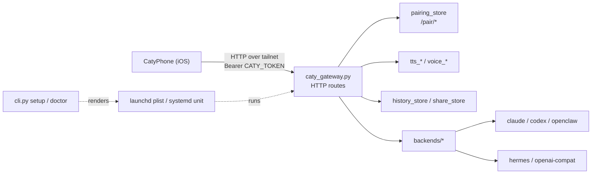

# エンジニア向けドキュメント

[← 玄関 README へ戻る](../README.ja.md) ｜ [🇺🇸 English](engineering.md) ｜ 📘 [詳細仕様](reference.ja.md)

caty-gateway は、CatyPhone（iOS クライアント）と、ホスト上で動く AI backend のあいだに立つ HTTP gateway です。1 メンバー = 1 常駐プロセス = 1 ポートで、ペアリングは Tailscale の tailnet か loopback からしか受け付けません。このページは「入れると決めた人」向けで、Quick Start → backend → 構成 → サービス運用 → 設定 → 開発の順に書いています。

---

## Quick Start

前提は `ffmpeg` / `ffprobe`・Tailscale ログイン済み・使う backend の CLI かサーバーの 3 つです。

```sh
uv tool install caty-gateway            # または pipx install caty-gateway
caty-gateway doctor --backend claude    # 受動チェックのみ。全 PASS まで直す
caty-gateway setup --member me --backend claude --plan-only   # 実行予定を確認（何も書かない）
caty-gateway setup --member me --backend claude               # サービス設置 → health → identity → QR
```

`setup` は preflight → 衝突検出 → サービス設置 → `/health` 待機 → `/identity` 認証確認 → voice 状態確認 → QR 表示の順に進みます。途中で止まったら `caty-gateway status --member me` で位置を確認し、同じコマンドを再実行すると続きから再開します。

<a id="commands"></a>

### サブコマンド

| コマンド | 役割 |
|---|---|
| `setup --member <id> --backend <b> [--port N] [--public-url URL] [--plan-only] [--no-history] [--reset]` | preflight から QR 表示までの一括セットアップ。`--plan-only` は計画表示のみ |
| `status --member <id> [--wait]` | セットアップ／supervisor の進行状態 |
| `serve` | フォアグラウンド起動。サービスから呼ばれる実体。非 loopback bind で `CATY_TOKEN` が空なら起動を拒否（fail-closed） |
| `qr [--member <id>] [--qr-delivery auto\|tty\|url]` | ペアリング QR の再発行 |
| `push open-url\|media …` | 接続中のクライアントに URL や画像を開かせる。詳細は [push.md](push.md) |
| `doctor --backend <b>` | backend 別 preflight を単独実行。受動チェックのみで AI にプロンプトは送らない |

引数の完全な一覧は [詳細仕様](reference.ja.md#cli) にあります。

---

<a id="backends"></a>

## Backends

`--backend` の 5 値と、それぞれが必要とする環境変数です。既定値は [env.md](env.md) の生成表が正です。

| 値 | アダプタ | 会話の方式 | 必須 env | 主な既定 |
|---|---|---|---|---|
| `claude` | `backends/claude.py` | per-turn CLI（`claude -p --resume`） | なし（`CATY_CLAUDE_CWD` は任意・既定 `~`） | `CATY_CLAUDE_BIN=claude` |
| `codex` | `backends/generic_cli.py` preset `codex` | per-turn CLI（`codex exec --json` / `exec resume`） | なし | `CATY_GCLI_BIN=codex` |
| `openclaw` | `backends/openclaw.py` | CLI（`openclaw agent --json`） | なし（`CATY_AGENT` は任意・既定 `main`） | `OPENCLAW_BIN=openclaw` |
| `hermes` | `backends/hermes.py` | HTTP `/v1/responses` | `CATY_HERMES_API_KEY` | `CATY_HERMES_URL=http://127.0.0.1:8642` |
| `openai-compat` | `backends/openai_compat.py` | HTTP `/v1/chat/completions` | `CATY_OPENAI_BASE_URL` `CATY_OPENAI_MODEL` | `CATY_OPENAI_API_KEY` は任意（Ollama / LM Studio は不要） |

`openai-compat` の `CATY_OPENAI_BASE_URL` は `/v1` まで含めます（例: Ollama は `http://127.0.0.1:11434/v1`）。`doctor` は `GET {BASE_URL}/models` が 200 を返し、`CATY_OPENAI_MODEL` が一覧に含まれることを確認します。

### doctor が見るもの

共通: OS（macOS / Linux）・Python 3.10 以上・`ffmpeg` `ffprobe`・Tailscale の実行ファイル／ログイン／IPv4・ポート未使用・`--public-url` の妥当性・書き込み先 3 ディレクトリの作成可否。backend 別: CLI のバージョン表示とログイン状態、HTTP backend は `/models` の到達確認。**プロンプトを送る確認は行いません**（利用枠・セッション永続化・作業ディレクトリの設定読込を避けるため）。`--probe` は予約済みで、このリリースでは `FAIL probe: --probe is unavailable in this release` を返して終了します。

---

<a id="architecture"></a>

## Architecture

設計原則は 1 つ、**gateway は入口であって AI ではない**です。会話の生成は既存の CLI／サーバーに委ね、gateway は認証・ペアリング・音声と添付の受け渡し・履歴だけを持ちます。



| モジュール（ラベル） | ファイル | 役割 |
|---|---|---|
| cli | `cli.py` `setup_orchestrator.py` `setup_supervisor.py` `doctor.py` | サブコマンド・preflight・サービス設置・進行状態 |
| server | `caty_gateway.py` | HTTP ルート（`/health` `/identity` `/history` `/share` `/see` `/push` `/tts/*` `/pair/*`）と認証 |
| backends | `backends/` | `base.Backend` を継承した 5 アダプタと `PRESETS` |
| pairing | `pairing_store.py` `docs/contracts/pairing-v1.md` | QR 発行・claim・revoke・ディスク正のストア |
| voice | `tts_fish.py` `voice_catalog.py` `voice_presets.py` `voice_preview.py` `voice_activation.py` `filler_*.py` | 読み上げ・声の一覧／プレビュー・つなぎ音声 |
| avatar | `avatar_engine.py` `face_core.py` `presence_state.py` | 表情フレーム・アバター生成（任意機能）・在席状態 |
| push | `caty_push.py` `push_events.py` | クライアントへの open-url / media 送出 |
| storage | `history_store.py` `share_store.py` `session_links.py` | 履歴・共有物・セッション紐付け（メンバーの state ディレクトリ配下） |
| packaging | `pyproject.toml` `templates/` | wheel・サービステンプレート・`importlib.resources` 経由の同梱資産 |
| docs | `README*.md` `docs/` `CONTRIBUTING.md` | このドキュメント群 |
| tests-ci | `tests/` `tools/` `.github/workflows/` | pytest・scrub 監査・env 台帳・公開ゲート・CI caller |

Issue ラベルの `component:*` は、この表の行と 1 対 1 です。

---

<a id="service"></a>

## サービス運用

`setup` はパッケージ同梱のテンプレートを描画して、ユーザー権限のサービスを 1 メンバー 1 つ作ります。macOS では root 権限は要りません。Linux では `loginctl enable-linger` に `sudo` が要るホストがあり、拒否されると `setup` がその旨を表示します。

| | macOS（launchd） | Linux（systemd --user） |
|---|---|---|
| ユニット | `~/Library/LaunchAgents/ai.caty.gateway.<id>.plist` | `caty-gateway-<id>.service` |
| 環境ファイル | plist 内（0600） | `~/.config/caty-gateway/<id>.env`（0600） |
| ログ | `~/Library/Logs/caty-gateway-<id>.log` | `journalctl --user -u caty-gateway-<id>` |
| 再起動 | `launchctl kickstart -k gui/$(id -u)/ai.caty.gateway.<id>` | `systemctl --user restart caty-gateway-<id>` |
| ログアウト後も動かす | 既定で GUI ドメインに常駐 | `loginctl enable-linger $USER` |

サービスは `KeepAlive` / `Restart=always` で、終了しても 5 秒以内に再起動します。再起動後もセッションは backend 側の resume 機構で続きます。

### 保存先

| 用途 | パス |
|---|---|
| 設定 | `~/.config/caty-gateway/<id>/`（`CATY_CONFIG_DIR`） |
| セットアップ進行状態 | `~/.local/state/caty-gateway/setup/<id>.*` |
| 会話履歴 | `~/.local/state/caty-gateway/history/<id>/`（`CATY_HISTORY_DIR`・`--no-history` で無効） |
| 同梱資産のコピー・つなぎ音声 | `~/.local/share/caty-gateway/<id>/{assets,fillers}` |
| ペアリングストア | `~/.local/state/caty-gateway/pairing/<member>/`（0700・`CATY_PAIRING_DIR` で変更可） |

<a id="reissue-qr"></a>

### QR の再発行

インストール済みメンバーの環境変数（トークン、ポート、公開 URL など）を読み込んで再発行します。

```sh
caty-gateway qr --member <id>
# ブラウザで表示する場合:
caty-gateway qr --member <id> --qr-delivery url
```

Linux では `~/.config/caty-gateway/<id>.env`、macOS では `~/Library/LaunchAgents/ai.caty.gateway.<id>.plist` の `EnvironmentVariables` を読み込みます。`PATH` を除き、インストール済みの値がシェルの環境変数を上書きします。設定ファイルの欠落・不正や `CATY_TOKEN` の欠落時は、ゲートウェイ本体を読み込む前にエラー終了します。

手動での読み込みも引き続き利用できます。サービスの環境変数を export したうえで、`--member` なしの `caty-gateway qr` を実行してください。

<a id="uninstall"></a>

### アンインストール

1. サービスを外す。macOS: `launchctl bootout gui/$(id -u)/ai.caty.gateway.<id>` のあと plist を削除。Linux: `systemctl --user disable --now caty-gateway-<id>` のあと `~/.config/caty-gateway/<id>.env` を削除
2. 上の保存先 5 つを削除（`~/.config/caty-gateway/` `~/.local/state/caty-gateway/` `~/.local/share/caty-gateway/` を丸ごと消せば足ります）
3. `uv tool uninstall caty-gateway`（pipx なら `pipx uninstall caty-gateway`）

backend 側の設定・作業ディレクトリには何も書いていません。会話は backend 自身のセッション記録（Claude Code のローカル会話ストア・Codex CLI の `~/.codex/sessions`）には残るので、必要ならそちらで消します。

---

<a id="configuration"></a>

## 設定

環境変数は Tier で分かれています。全表（既定値・出現箇所つき）は生成物の [env.md](env.md) が正で、手で編集しません。

| やりたいこと | 見る変数 | Tier |
|---|---|---|
| メンバーの名前・色・ポートを変える | `CATY_ID` `CATY_NAME` `CATY_ACCENT_COLOR` `CATY_GATEWAY_PORT` | A |
| bind 先と QR に載せる URL を変える | `CATY_GATEWAY_BIND` `CATY_PUBLIC_URL` | A |
| 認証 | `CATY_TOKEN` `CATY_ADMIN_TOKEN` `CATY_REQUIRE_AUTH` | A |
| backend を切り替える | `CATY_BACKEND` と各 backend の変数 | A / B |
| ペアリングの閾値（TTL・レート・ロックアウト） | `CATY_PAIRING_*` | B2 |
| 読み上げ・アバター・画面説明などの任意機能 | `CATY_TTS_*` `CATY_AVATAR_*` `ANTHROPIC_API_KEY` ほか | C |
| プロンプト内の呼び名を変える | `CATY_USER_NAME`（既定 `ユーザー`） | A |

秘密情報（Tier の sensitivity = secret）はコマンドラインに載せず、0600 の環境ファイルに置きます。任意機能が外部へ送る内容は [privacy.md](privacy.md) に列挙しています。

### Windows

native の Windows サービスは未対応です。WSL2 上の Linux として扱えば systemd 経路が使えますが、Tailscale を WSL2 側でログインさせる必要があり、この組み合わせはまだ実測していません。

### 非サポートの上級者向けスイッチ

`CATY_PAIRING_ALLOW_NONTAILNET=1` を立てると、`/pair/claim` が**到達可能な全ピア**（カフェや寮の LAN を含む）に開きます。QR 配信側のゲートは広がりません。開発用のバイパスであり、サポート対象外です。詳細は [pairing-v1.md](contracts/pairing-v1.md)。

---

<a id="development"></a>

## 開発

```sh
python3 -m venv .venv && . .venv/bin/activate
pip install -e '.[test]'
make test        # pytest + scrub 監査 + env 台帳の差分・分類チェック + 公開ゲート
make lint        # compileall + env 台帳チェック
make gate        # 公開ゲート単体（個人 URL・denylist・selftest）
```

- `docs/env.md` は `python tools/env-inventory.py` の生成物です。環境変数を増減したら再生成し、未分類の名前は `tools/env-inventory.py` の分類表に追加します
- `tools/scrub-audit.sh` は秘密情報らしき文字列を検出します。個人名・内部パスの検出は private リストを読み込んだときだけ働きます（後述「Private scrub list」・CI は公開ルールのみ）。例外は `.scrub-allow` に理由つきで足します
- `tools/check_publication_gate.py` は公開リポジトリ caty-ai/family-dev-handbook の `templates/publication-gate/` にある正本と byte-identical に vendoring しています。ローカルでは `make gate` で同じ検査が走ります
- CI は PR ごとに Ubuntu で `make test` / `make lint` を実行します。hosted macOS レーンは公開時に有効化予定で、それまでは skip 理由を caller に明記しています

backend の追加手順は [CONTRIBUTING.md](../CONTRIBUTING.md) にあります。

### Private scrub list

個人名や内部パスの検査リストは、Git 管理外の `<root>/.scrub-private` に置きます。
別の場所に置く場合は `SCRUB_PRIVATE_FILE` で指定してください。
`.scrub-private.example` をひな形に、UTF-8 で `[names]`・`[literals]`・`[stems]`・
`[repos]` の各節へ1行1件、そのままの文字列を書きます。空行と `#` のコメント行は無視します。
CI にはこのファイルを置かず、公開ルールだけで検査します。リリースチェックリストでは、
タグを打つ前に手元でリストを読み込ませて `bash tools/scrub-audit.sh .` を実行し、
指摘がないことを確認します。

---

## ドキュメント索引

| ページ | 内容 |
|---|---|
| [詳細仕様](reference.ja.md) | CLI 引数・HTTP ルートと認証・保存先・ペアリング契約の要約 |
| [env.md](env.md) | 環境変数の全表（生成） |
| [self-hosting.md](self-hosting.md) | サービス設置の補足（英語） |
| [push.md](push.md) | push helper の使い方（英語） |
| [privacy.md](privacy.md) | 外部送信の一覧（英語） |
| [contracts/pairing-v1.md](contracts/pairing-v1.md) | ペアリング契約 v1（英語・凍結） |
