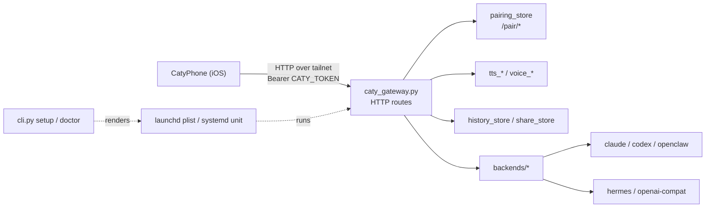

# Engineering guide

[← Back to README](../README.md) ｜ [🇯🇵 日本語](engineering.ja.md) ｜ 📘 [Reference](reference.md)

caty-gateway is an HTTP gateway that sits between CatyPhone (the iOS client) and an AI backend running on the host. One member = one resident process = one port, and pairing is only accepted from a Tailscale tailnet or loopback. This page is for people who have already decided to install it, and it is organized Quick Start → backends → architecture → service operation → configuration → development.

---

## Quick Start

The prerequisites are just three things: `ffmpeg` / `ffprobe`, an already logged-in Tailscale, and the CLI or server for the backend you plan to use.

```sh
curl -fsSL https://caty.talk/gateway/install.sh | sh   # one-command install (coming with the PyPI release)
uv tool install caty-gateway            # or: pipx install caty-gateway
caty-gateway doctor --backend claude    # passive checks only. Fix until everything is PASS
caty-gateway setup --member me --backend claude --plan-only   # preview the planned actions (writes nothing)
caty-gateway setup --member me --backend claude               # install service → health → identity → QR
```

`setup` proceeds in this order: preflight → conflict detection → service install → wait for `/health` → verify `/identity` authentication → check voice status → show QR. If it stops partway, run `caty-gateway status --member me` to see where it is; re-running the same command resumes from that point.

<a id="commands"></a>

### Subcommands

| Command | Role |
|---|---|
| `setup --member <id> --backend <b> [--port N] [--public-url URL] [--plan-only] [--no-history] [--reset]` | One-shot setup from preflight through showing the QR. `--plan-only` only displays the plan |
| `status --member <id> [--wait]` | Progress of setup / supervisor |
| `serve` | Foreground start. This is the actual process the service invokes. Refuses to start on a non-loopback bind if `CATY_TOKEN` is empty (fail-closed) |
| `qr [--member <id>] [--qr-delivery auto\|tty\|url]` | Reissue the pairing QR |
| `push open-url\|media …` | Makes a connected client open a URL or image. See [push.md](push.md) for details |
| `doctor --backend <b>` | Runs backend-specific preflight on its own. Passive checks only; never sends a prompt to the AI |

The full argument list is in the [Reference](reference.md#cli).

---

<a id="backends"></a>

## Backends

The five values for `--backend`, and the environment variables each one requires. The generated table in [env.md](env.md) is the source of truth for defaults.

| Value | Adapter | Conversation mechanism | Required env | Main default |
|---|---|---|---|---|
| `claude` | `backends/claude.py` | per-turn CLI (`claude -p --resume`) | none (`CATY_CLAUDE_CWD` is optional, default `~`) | `CATY_CLAUDE_BIN=claude` |
| `codex` | `backends/generic_cli.py` preset `codex` | per-turn CLI (`codex exec --json` / `exec resume`) | none | `CATY_GCLI_BIN=codex` |
| `openclaw` | `backends/openclaw.py` | CLI (`openclaw agent --json`) | none (`CATY_AGENT` is optional, default `main`) | `OPENCLAW_BIN=openclaw` |
| `hermes` | `backends/hermes.py` | HTTP `/v1/responses` | `CATY_HERMES_API_KEY` | `CATY_HERMES_URL=http://127.0.0.1:8642` |
| `openai-compat` | `backends/openai_compat.py` | HTTP `/v1/chat/completions` | `CATY_OPENAI_BASE_URL` `CATY_OPENAI_MODEL` | `CATY_OPENAI_API_KEY` is optional (not needed for Ollama / LM Studio) |

`CATY_OPENAI_BASE_URL` for `openai-compat` must include the trailing `/v1` (for example, Ollama is `http://127.0.0.1:11434/v1`). `doctor` verifies that `GET {BASE_URL}/models` returns 200 and that `CATY_OPENAI_MODEL` appears in the listing.

### What doctor checks

Common: OS (macOS / Linux), Python 3.10 or later, `ffmpeg` / `ffprobe`, Tailscale executable / login / IPv4, whether the port is free, validity of `--public-url`, and whether the three storage directories can be created. Backend-specific: CLI version output and login state, and for HTTP backends, whether `/models` is reachable. **It does not send a prompt to verify anything** (to avoid consuming quota, persisting a session, or loading working-directory configuration). `--probe` is reserved and in this release returns `FAIL probe: --probe is unavailable in this release` and exits.

---

<a id="architecture"></a>

## Architecture

There is one design principle: **the gateway is an entry point, not the AI**. Conversation generation is delegated to the existing CLI or server, and the gateway only handles authentication, pairing, passing voice and attachments back and forth, and history.



| Module (label) | Files | Role |
|---|---|---|
| cli | `cli.py` `setup_orchestrator.py` `setup_supervisor.py` `doctor.py` | Subcommands, preflight, service install, progress state |
| server | `caty_gateway.py` | HTTP routes (`/health` `/identity` `/history` `/share` `/see` `/push` `/tts/*` `/pair/*`) and authentication |
| backends | `backends/` | Five adapters that extend `base.Backend`, plus `PRESETS` |
| pairing | `pairing_store.py` `docs/contracts/pairing-v1.md` | QR issuance, claim, revoke, disk-authoritative store |
| voice | `tts_fish.py` `voice_catalog.py` `voice_presets.py` `voice_preview.py` `voice_activation.py` `filler_*.py` | Speech synthesis, voice listing/preview, filler audio |
| avatar | `avatar_engine.py` `face_core.py` `presence_state.py` | Expression frames, avatar generation (optional feature), presence state |
| push | `caty_push.py` `push_events.py` | Sending open-url / media to clients |
| storage | `history_store.py` `share_store.py` `session_links.py` | History, shared items, session linkage (under each member's state directory) |
| packaging | `pyproject.toml` `templates/` | Wheel, service templates, bundled assets served via `importlib.resources` |
| docs | `README*.md` `docs/` `CONTRIBUTING.md` | This set of documentation |
| tests-ci | `tests/` `tools/` `.github/workflows/` | pytest, scrub audit, env inventory, publication gate, CI caller |

The `component:*` Issue labels correspond one-to-one with the rows of this table.

---

<a id="service"></a>

## Service operation

`setup` renders a template bundled in the package and creates one user-level service per member. Root privileges are not required on macOS. On Linux, `loginctl enable-linger` may need `sudo` on some hosts; `setup` says so when it is denied.

| | macOS (launchd) | Linux (systemd --user) |
|---|---|---|
| Unit | `~/Library/LaunchAgents/ai.caty.gateway.<id>.plist` | `caty-gateway-<id>.service` |
| Environment file | Inside the plist (0600) | `~/.config/caty-gateway/<id>.env` (0600) |
| Log | `~/Library/Logs/caty-gateway-<id>.log` | `journalctl --user -u caty-gateway-<id>` |
| Restart | `launchctl kickstart -k gui/$(id -u)/ai.caty.gateway.<id>` | `systemctl --user restart caty-gateway-<id>` |
| Keep running after logout | Resident in the GUI domain by default | `loginctl enable-linger $USER` |

The service uses `KeepAlive` / `Restart=always` and restarts within 5 seconds if it exits. After a restart, the session continues via the backend's own resume mechanism.

### Storage locations

| Purpose | Path |
|---|---|
| Configuration | `~/.config/caty-gateway/<id>/` (`CATY_CONFIG_DIR`) |
| Setup progress state | `~/.local/state/caty-gateway/setup/<id>.*` |
| Conversation history | `~/.local/state/caty-gateway/history/<id>/` (`CATY_HISTORY_DIR`; disabled with `--no-history`) |
| Copies of bundled assets, filler audio | `~/.local/share/caty-gateway/<id>/{assets,fillers}` |
| Pairing store | `~/.local/state/caty-gateway/pairing/<member>/` (0700; override with `CATY_PAIRING_DIR`) |

<a id="reissue-qr"></a>

### Reissuing the QR

Use the installed member's environment, including its token, port, and public URL:

```sh
caty-gateway qr --member <id>
# For a browser-viewable QR:
caty-gateway qr --member <id> --qr-delivery url
```

On Linux, this reads `~/.config/caty-gateway/<id>.env`; on macOS, it reads `EnvironmentVariables` from `~/Library/LaunchAgents/ai.caty.gateway.<id>.plist`. Installed values override the current shell environment except for `PATH`. Missing or invalid configuration, including a missing `CATY_TOKEN`, exits with an error before the gateway runtime loads.

Manual sourcing still works: export the service environment and run `caty-gateway qr` without `--member`.

<a id="uninstall"></a>

### Uninstalling

1. Remove the service. macOS: `launchctl bootout gui/$(id -u)/ai.caty.gateway.<id>`, then delete the plist. Linux: `systemctl --user disable --now caty-gateway-<id>`, then delete `~/.config/caty-gateway/<id>.env`
2. Delete the five storage locations above (removing `~/.config/caty-gateway/`, `~/.local/state/caty-gateway/` and `~/.local/share/caty-gateway/` entirely is enough)
3. `uv tool uninstall caty-gateway` (or `pipx uninstall caty-gateway` for pipx)

The gateway writes nothing into the backend's configuration or working directory. The conversation does remain in the backend's own session store (Claude Code's local conversation store; `~/.codex/sessions` for Codex CLI); remove it there if required.

---

<a id="configuration"></a>

## Configuration

Environment variables are split into tiers. The generated [env.md](env.md) is the source of truth for the full table (defaults and where each variable is used); it is not hand-edited.

| What you want to do | Variables to look at | Tier |
|---|---|---|
| Change a member's name, color, port | `CATY_ID` `CATY_NAME` `CATY_ACCENT_COLOR` `CATY_GATEWAY_PORT` | A |
| Change the bind address and the URL shown in the QR | `CATY_GATEWAY_BIND` `CATY_PUBLIC_URL` | A |
| Authentication | `CATY_TOKEN` `CATY_ADMIN_TOKEN` `CATY_REQUIRE_AUTH` | A |
| Switch backends | `CATY_BACKEND` and each backend's own variables | A / B |
| Pairing thresholds (TTL, rate, lockout) | `CATY_PAIRING_*` | B2 |
| Optional features such as speech, avatar, screen description | `CATY_TTS_*` `CATY_AVATAR_*` `ANTHROPIC_API_KEY` and others | C |
| Change the name used to address the user in prompts | `CATY_USER_NAME` (default `ユーザー`) | A |

Secrets (Tier sensitivity = secret) must not be placed on the command line; put them in a 0600 environment file. What optional features send externally is listed in [privacy.md](privacy.md).

### Windows

There is no native Windows service support. Treating it as Linux under WSL2 lets you use the systemd path, but Tailscale needs to be logged in from inside WSL2, and this combination has not been tested yet.

### Unsupported advanced switch

Setting `CATY_PAIRING_ALLOW_NONTAILNET=1` opens `/pair/claim` to **every reachable peer** (including a café or dorm LAN). It does not widen the QR-delivery gate. This is a development bypass and is not supported. See [pairing-v1.md](contracts/pairing-v1.md) for details.

---

<a id="development"></a>

## Development

```sh
python3 -m venv .venv && . .venv/bin/activate
pip install -e '.[test]'
make test        # pytest + scrub audit + env inventory diff/classification check + publication gate
make lint        # compileall + env inventory check
make gate        # publication gate alone (personal URLs, denylist, selftest)
```

- `docs/env.md` is generated by `python tools/env-inventory.py`. Regenerate it whenever you add or remove an environment variable, and add unclassified names to the classification table in `tools/env-inventory.py`
- `tools/scrub-audit.sh` detects strings that look like secrets; personal names and internal paths are detected only when the private list is loaded (see "Private scrub list" — CI runs public rules only). Add exceptions to `.scrub-allow` with a reason
- `tools/check_publication_gate.py` is vendored byte-identical from the template in the public caty-ai/family-dev-handbook repository (`templates/publication-gate/`). Locally, `make gate` runs the same checks
- CI runs `make test` / `make lint` on Ubuntu for every PR. The hosted macOS lane is planned to be enabled at publication time; until then, the reason for skipping it is documented in the caller

The procedure for adding a backend is in [CONTRIBUTING.md](../CONTRIBUTING.md).

### Private scrub list

Keep local detectors in the git-ignored `<root>/.scrub-private`, or set
`SCRUB_PRIVATE_FILE` to another file. Copy `.scrub-private.example` as a starting
point: UTF-8, `[names]`, `[literals]`, `[stems]`, `[repos]`, one verbatim entry per
line; blank lines and `#` comment lines are ignored. CI has no private list and
runs public rules only. The release checklist requires running
`bash tools/scrub-audit.sh .` locally with the private list loaded before tagging.

---

## Documentation index

| Page | Contents |
|---|---|
| [Reference](reference.md) | CLI arguments, HTTP routes and authentication, storage locations, pairing contract summary |
| [env.md](env.md) | Full table of environment variables (generated) |
| [self-hosting.md](self-hosting.md) | Supplementary notes on service installation |
| [push.md](push.md) | How to use the push helper |
| [privacy.md](privacy.md) | List of external data sent |
| [contracts/pairing-v1.md](contracts/pairing-v1.md) | Pairing contract v1 (frozen) |
